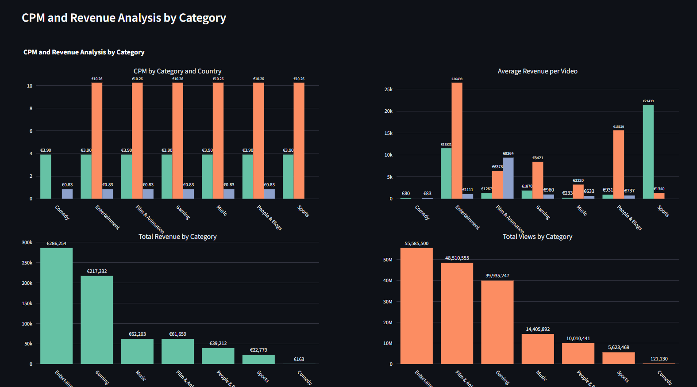
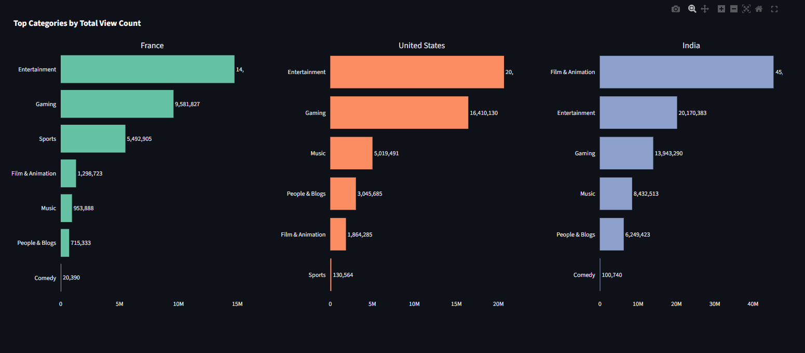
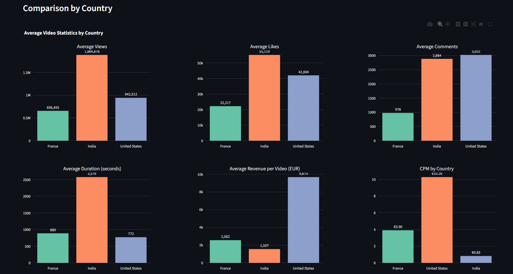
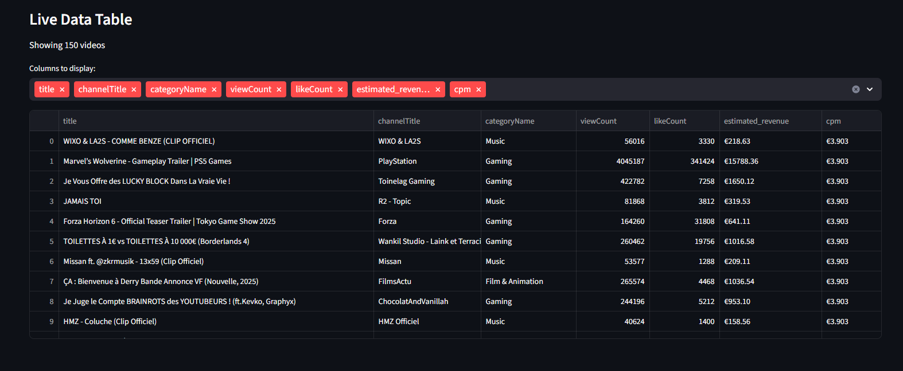

# DataScience Project

Welcome to the DataScience project! This repository contains code, data, and documentation for data analysis of the Youtube most popular videos.

## Project Structure

- `docs` : Documentation for the project
- `pics` : Images for the project
- `main.py` : Source code for the project

## Getting Started

1. Clone the repository:
   ```bash
   git clone https://github.com/Maisquasar/Data-Science.git
   ```
2. Install dependencies:
   ```bash
   pip install -r requirements.txt
   ```
3. Get an API-KEY from [here](https://developers.google.com/youtube/v3/getting-started)

4. Create a file called `api_key.txt` and put your API-KEY in it

5. Run the main script:
   ```bash
   streamlit run main.py
   ```

## Requirements

- Python 3.8+
- See `requirements.txt` for full dependencies

## Images




